# Entity Relationship Diagram (ERD)

## Invoicein — Database Schema Design

**Date:** 2026-04-09
**Database:** PostgreSQL 15 (Supabase)
**ORM:** Drizzle ORM

---

## ERD Diagram (Mermaid)

```mermaid
erDiagram
    %% ==========================================
    %% CORE: TENANTS & USERS
    %% ==========================================

    tenants {
        uuid id PK
        varchar slug UK "ratna-florist"
        varchar name "Ratna Florist"
        varchar email
        varchar phone
        text address
        varchar city
        varchar province
        varchar postal_code
        varchar npwp "optional, encrypted"
        varchar business_type "florist, freelancer, workshop, etc"
        varchar logo_url "R2 storage URL"
        varchar subscription_plan "free, professional, business"
        timestamp subscription_expires_at
        varchar invoice_prefix "INV"
        varchar invoice_format "PREFIX/YYYY/MM/SEQ"
        integer invoice_sequence_counter "auto-increment per tenant"
        varchar default_currency "IDR"
        varchar default_payment_terms "net_30"
        text default_notes "default invoice footer notes"
        text default_terms "default terms & conditions"
        boolean ppn_enabled "default true"
        decimal ppn_rate "11.00"
        jsonb branding "colors, font preferences"
        timestamp created_at
        timestamp updated_at
        timestamp deleted_at "soft delete"
    }

    tenant_bank_accounts {
        uuid id PK
        uuid tenant_id FK
        varchar bank_name "BCA, Mandiri, BRI, BNI"
        varchar account_number "encrypted"
        varchar account_holder_name
        varchar bank_code "optional, for VA"
        boolean is_primary "default display on invoices"
        boolean is_active
        timestamp created_at
    }

    tenant_qris {
        uuid id PK
        uuid tenant_id FK
        varchar qris_image_url "R2 storage URL"
        varchar qris_nmid "optional"
        boolean is_active
        timestamp created_at
    }

    users {
        uuid id PK "matches Supabase Auth uid"
        uuid tenant_id FK
        varchar email UK
        varchar full_name
        varchar phone
        varchar avatar_url
        varchar role "owner, admin, staff, viewer"
        varchar locale "id, en"
        boolean is_active
        timestamp last_login_at
        timestamp created_at
        timestamp updated_at
    }

    %% ==========================================
    %% CLIENTS (CUSTOMERS OF THE TENANT)
    %% ==========================================

    clients {
        uuid id PK
        uuid tenant_id FK
        varchar name "Bu Sari, PT Maju Jaya"
        varchar email "optional"
        varchar phone "WA number, required"
        text address "optional"
        varchar city
        varchar province
        varchar npwp "optional, for tax invoices"
        varchar contact_person "optional"
        text notes "internal notes"
        decimal total_billed "denormalized, lifetime"
        decimal total_paid "denormalized, lifetime"
        integer invoice_count "denormalized"
        integer avg_payment_days "AI: average days to pay"
        timestamp created_at
        timestamp updated_at
        timestamp deleted_at "soft delete"
    }

    %% ==========================================
    %% PRODUCT / SERVICE CATALOG
    %% ==========================================

    products {
        uuid id PK
        uuid tenant_id FK
        varchar name "Buket Mawar Premium"
        text description "optional"
        varchar sku "optional, for inventory"
        varchar unit "pcs, kg, jam, paket, dll"
        decimal unit_price "default price"
        varchar tax_category "taxable, non_taxable, exempt"
        varchar category "optional, AI-assigned or manual"
        boolean track_inventory "Phase 3"
        integer stock_quantity "Phase 3, nullable"
        boolean is_active
        timestamp created_at
        timestamp updated_at
        timestamp deleted_at "soft delete"
    }

    %% ==========================================
    %% QUOTATIONS
    %% ==========================================

    quotations {
        uuid id PK
        uuid tenant_id FK
        uuid client_id FK
        varchar quotation_number UK "QUO/2026/04/001"
        varchar status "draft, sent, viewed, accepted, rejected, expired, converted"
        date issue_date
        date valid_until
        decimal subtotal
        decimal discount_amount
        varchar discount_type "percentage, fixed"
        decimal discount_value
        decimal tax_amount
        decimal total
        text notes
        text terms
        uuid converted_invoice_id FK "nullable, links to invoice if converted"
        uuid created_by FK "user who created"
        timestamp sent_at
        timestamp viewed_at
        timestamp accepted_at
        timestamp rejected_at
        timestamp created_at
        timestamp updated_at
        timestamp deleted_at
    }

    quotation_lines {
        uuid id PK
        uuid quotation_id FK
        uuid product_id FK "nullable, can be custom line"
        varchar description
        decimal quantity
        varchar unit
        decimal unit_price
        decimal discount_percent "0-100"
        boolean is_taxable
        decimal line_total "calculated"
        integer sort_order
        timestamp created_at
    }

    %% ==========================================
    %% INVOICES (CORE)
    %% ==========================================

    invoices {
        uuid id PK
        uuid tenant_id FK
        uuid client_id FK
        uuid quotation_id FK "nullable, if converted from quotation"
        uuid recurring_invoice_id FK "nullable, if auto-generated"
        varchar invoice_number UK "INV/2026/04/001"
        varchar status "draft, sent, viewed, partial, paid, overdue, cancelled, refunded"
        date issue_date
        date due_date
        decimal subtotal
        decimal discount_amount
        varchar discount_type "percentage, fixed"
        decimal discount_value "the input value"
        decimal tax_amount
        decimal total
        decimal amount_paid "sum of payments"
        decimal amount_due "total - amount_paid"
        varchar currency "IDR"
        text notes "displayed on invoice"
        text terms "terms & conditions"
        text internal_notes "not displayed"
        varchar pdf_url "R2 storage URL"
        varchar public_token UK "for public invoice page"
        uuid created_by FK
        timestamp sent_at
        timestamp viewed_at
        timestamp paid_at
        timestamp cancelled_at
        timestamp overdue_notified_at
        timestamp created_at
        timestamp updated_at
        timestamp deleted_at
    }

    invoice_lines {
        uuid id PK
        uuid invoice_id FK
        uuid product_id FK "nullable"
        varchar description
        decimal quantity
        varchar unit
        decimal unit_price
        decimal discount_percent "0-100"
        boolean is_taxable
        decimal tax_rate "11.00 if taxable"
        decimal tax_amount "calculated"
        decimal line_total "calculated, before tax"
        integer sort_order
        timestamp created_at
    }

    %% ==========================================
    %% PAYMENTS
    %% ==========================================

    payments {
        uuid id PK
        uuid tenant_id FK
        uuid invoice_id FK
        decimal amount
        varchar payment_method "bank_transfer, cash, qris, e_wallet, credit_card, midtrans"
        varchar payment_channel "bca_va, mandiri_va, gopay, shopeepay, etc"
        varchar reference_number "transfer ref, midtrans order_id"
        varchar midtrans_transaction_id "nullable"
        varchar midtrans_status "nullable"
        text notes
        date payment_date
        varchar proof_url "R2 URL, receipt/screenshot"
        varchar status "pending, confirmed, failed, refunded"
        uuid recorded_by FK "user who recorded, null if auto"
        timestamp confirmed_at
        timestamp created_at
    }

    %% ==========================================
    %% CREDIT NOTES
    %% ==========================================

    credit_notes {
        uuid id PK
        uuid tenant_id FK
        uuid invoice_id FK "original invoice"
        uuid client_id FK
        varchar credit_note_number UK "CN/2026/04/001"
        varchar status "draft, issued, applied, void"
        date issue_date
        decimal subtotal
        decimal tax_amount
        decimal total
        text reason
        text notes
        uuid created_by FK
        timestamp created_at
        timestamp updated_at
    }

    credit_note_lines {
        uuid id PK
        uuid credit_note_id FK
        uuid invoice_line_id FK "nullable, ref to original line"
        varchar description
        decimal quantity
        varchar unit
        decimal unit_price
        boolean is_taxable
        decimal tax_amount
        decimal line_total
        integer sort_order
        timestamp created_at
    }

    %% ==========================================
    %% RECURRING INVOICES
    %% ==========================================

    recurring_invoices {
        uuid id PK
        uuid tenant_id FK
        uuid client_id FK
        varchar title "Monthly Retainer - Bu Sari"
        varchar frequency "weekly, biweekly, monthly, quarterly, yearly, custom"
        integer interval_days "for custom frequency"
        date start_date
        date end_date "nullable, runs forever if null"
        date next_issue_date "computed, when next invoice will be created"
        integer occurrences_limit "nullable, max number of invoices"
        integer occurrences_count "how many generated so far"
        varchar status "active, paused, completed, cancelled"
        boolean auto_send "auto-send on creation?"
        varchar send_channel "email, whatsapp, both"
        integer payment_terms_days "14, 30, etc"
        text notes
        text terms
        decimal subtotal
        decimal tax_amount
        decimal total
        uuid created_by FK
        timestamp last_generated_at
        timestamp created_at
        timestamp updated_at
    }

    recurring_invoice_lines {
        uuid id PK
        uuid recurring_invoice_id FK
        uuid product_id FK "nullable"
        varchar description
        decimal quantity
        varchar unit
        decimal unit_price
        decimal discount_percent
        boolean is_taxable
        decimal line_total
        integer sort_order
        timestamp created_at
    }

    %% ==========================================
    %% EXPENSES (Phase 2)
    %% ==========================================

    expenses {
        uuid id PK
        uuid tenant_id FK
        varchar category "supplies, transport, utilities, salary, marketing, other"
        varchar description
        decimal amount
        varchar currency "IDR"
        date expense_date
        varchar receipt_url "R2 URL"
        varchar payment_method "cash, bank_transfer, e_wallet"
        text notes
        uuid created_by FK
        timestamp created_at
        timestamp updated_at
        timestamp deleted_at
    }

    %% ==========================================
    %% NOTIFICATIONS & ACTIVITY
    %% ==========================================

    notifications {
        uuid id PK
        uuid tenant_id FK
        uuid invoice_id FK "nullable"
        uuid client_id FK "nullable"
        varchar channel "email, whatsapp"
        varchar type "invoice_sent, payment_reminder, payment_received, quotation_sent"
        varchar status "queued, sent, delivered, read, failed"
        varchar recipient_contact "email or phone"
        text message_preview "first 200 chars"
        varchar external_id "Fonnte msg ID, Resend email ID"
        jsonb metadata "delivery details, error messages"
        timestamp scheduled_at "for reminders"
        timestamp sent_at
        timestamp delivered_at
        timestamp read_at
        timestamp failed_at
        timestamp created_at
    }

    activity_logs {
        uuid id PK
        uuid tenant_id FK
        uuid user_id FK "nullable, null for system actions"
        varchar entity_type "invoice, client, payment, quotation"
        uuid entity_id
        varchar action "created, updated, sent, paid, viewed, deleted"
        jsonb changes "before/after diff for auditing"
        varchar ip_address
        varchar user_agent
        timestamp created_at
    }

    %% ==========================================
    %% AI FEATURES
    %% ==========================================

    ai_usage_logs {
        uuid id PK
        uuid tenant_id FK
        uuid user_id FK
        varchar feature "chat_to_invoice, voice_to_invoice, insights, categorization"
        text input_text "user prompt, truncated"
        text output_summary "what was generated"
        integer tokens_used
        integer latency_ms
        varchar model "claude-haiku, claude-sonnet"
        varchar status "success, failed, rejected"
        timestamp created_at
    }

    %% ==========================================
    %% SAAS SUBSCRIPTIONS (Tenant's plan)
    %% ==========================================

    subscriptions {
        uuid id PK
        uuid tenant_id FK
        varchar plan "free, professional, business"
        varchar billing_cycle "monthly, yearly"
        decimal price
        varchar currency "IDR"
        varchar status "active, past_due, cancelled, expired"
        varchar midtrans_subscription_id "nullable"
        date current_period_start
        date current_period_end
        date cancelled_at "nullable"
        integer invoice_count_this_month "for free tier limit"
        integer ai_usage_count_this_month "for pro tier limit"
        timestamp created_at
        timestamp updated_at
    }

    subscription_invoices {
        uuid id PK
        uuid subscription_id FK
        uuid tenant_id FK
        varchar midtrans_order_id
        decimal amount
        varchar status "pending, paid, failed, expired"
        date billing_date
        date paid_at
        varchar payment_url "Midtrans Snap URL"
        timestamp created_at
    }

    %% ==========================================
    %% RELATIONSHIPS
    %% ==========================================

    tenants ||--o{ tenant_bank_accounts : "has"
    tenants ||--o{ tenant_qris : "has"
    tenants ||--o{ users : "has members"
    tenants ||--o{ clients : "has customers"
    tenants ||--o{ products : "has catalog"
    tenants ||--o{ invoices : "creates"
    tenants ||--o{ quotations : "creates"
    tenants ||--o{ recurring_invoices : "has"
    tenants ||--o{ expenses : "tracks"
    tenants ||--o{ notifications : "sends"
    tenants ||--o{ activity_logs : "records"
    tenants ||--o{ ai_usage_logs : "uses AI"
    tenants ||--|| subscriptions : "subscribes"

    clients ||--o{ invoices : "billed to"
    clients ||--o{ quotations : "quoted to"
    clients ||--o{ credit_notes : "credited to"
    clients ||--o{ recurring_invoices : "billed to"

    invoices ||--o{ invoice_lines : "has items"
    invoices ||--o{ payments : "receives"
    invoices ||--o{ credit_notes : "refunded by"
    invoices ||--o{ notifications : "triggers"

    quotations ||--o{ quotation_lines : "has items"
    quotations ||--o| invoices : "converts to"

    recurring_invoices ||--o{ recurring_invoice_lines : "has items"
    recurring_invoices ||--o{ invoices : "generates"

    credit_notes ||--o{ credit_note_lines : "has items"

    products ||--o{ invoice_lines : "referenced in"
    products ||--o{ quotation_lines : "referenced in"
    products ||--o{ recurring_invoice_lines : "referenced in"

    users ||--o{ invoices : "creates"
    users ||--o{ quotations : "creates"
    users ||--o{ payments : "records"
    users ||--o{ activity_logs : "performs"
    users ||--o{ ai_usage_logs : "uses"

    subscriptions ||--o{ subscription_invoices : "billed via"
```



---

## Table Summary

| Table | Purpose | Phase |
|-------|---------|-------|
| `tenants` | Business/organization (multi-tenant root) | 1 |
| `tenant_bank_accounts` | Bank account details shown on invoices | 1 |
| `tenant_qris` | QRIS payment codes | 1 |
| `users` | Authenticated users within a tenant | 1 |
| `clients` | Customers of the tenant | 1 |
| `products` | Product/service catalog | 1 |
| `invoices` | Core invoice records | 1 |
| `invoice_lines` | Line items on invoices | 1 |
| `quotations` | Quotation/estimate records | 1 |
| `quotation_lines` | Line items on quotations | 1 |
| `payments` | Payment records against invoices | 1 |
| `recurring_invoices` | Templates for auto-generated invoices | 2 |
| `recurring_invoice_lines` | Line items on recurring templates | 2 |
| `credit_notes` | Refund/credit documents | 2 |
| `credit_note_lines` | Line items on credit notes | 2 |
| `expenses` | Business expense records | 2 |
| `notifications` | Email/WA notification tracking | 1 |
| `activity_logs` | Audit trail for all actions | 1 |
| `ai_usage_logs` | AI feature usage tracking + billing | 2 |
| `subscriptions` | SaaS plan subscriptions | 1 |
| `subscription_invoices` | Billing for the SaaS subscription itself | 1 |

---

## Key Indexes

```sql
-- Performance-critical indexes
CREATE INDEX idx_invoices_tenant_status ON invoices(tenant_id, status);
CREATE INDEX idx_invoices_tenant_due_date ON invoices(tenant_id, due_date);
CREATE INDEX idx_invoices_tenant_client ON invoices(tenant_id, client_id);
CREATE INDEX idx_invoices_public_token ON invoices(public_token);
CREATE INDEX idx_invoice_lines_invoice ON invoice_lines(invoice_id);
CREATE INDEX idx_payments_invoice ON payments(invoice_id);
CREATE INDEX idx_payments_tenant ON payments(tenant_id, payment_date);
CREATE INDEX idx_clients_tenant ON clients(tenant_id);
CREATE INDEX idx_clients_tenant_phone ON clients(tenant_id, phone);
CREATE INDEX idx_products_tenant ON products(tenant_id);
CREATE INDEX idx_notifications_tenant_status ON notifications(tenant_id, status);
CREATE INDEX idx_notifications_scheduled ON notifications(scheduled_at) WHERE status = 'queued';
CREATE INDEX idx_activity_logs_tenant_entity ON activity_logs(tenant_id, entity_type, entity_id);
CREATE INDEX idx_recurring_invoices_next ON recurring_invoices(next_issue_date) WHERE status = 'active';
```

---

## Row-Level Security Policies

Every table with `tenant_id` gets this RLS policy:

```sql
-- Enable RLS
ALTER TABLE invoices ENABLE ROW LEVEL SECURITY;

-- Tenant isolation
CREATE POLICY "tenant_isolation" ON invoices
  FOR ALL
  USING (tenant_id = (auth.jwt() -> 'app_metadata' ->> 'tenant_id')::uuid)
  WITH CHECK (tenant_id = (auth.jwt() -> 'app_metadata' ->> 'tenant_id')::uuid);

-- Public invoice access (no auth required, by token)
CREATE POLICY "public_invoice_view" ON invoices
  FOR SELECT
  USING (public_token IS NOT NULL AND status != 'draft');
```

---

## Enum Values Reference

```
-- Invoice Status Flow
draft → sent → viewed → partial → paid
                    ↘ overdue (cron job updates daily)
                    ↘ cancelled
                    ↘ refunded (via credit note)

-- Quotation Status Flow  
draft → sent → viewed → accepted → converted
                     ↘ rejected
                     ↘ expired (past valid_until)

-- Payment Status
pending → confirmed
       ↘ failed
       ↘ refunded

-- Subscription Plan
free | professional | business

-- User Role
owner | admin | staff | viewer

-- Notification Channel
email | whatsapp

-- Payment Method
bank_transfer | cash | qris | e_wallet | credit_card | midtrans

-- Frequency
weekly | biweekly | monthly | quarterly | yearly | custom
```
